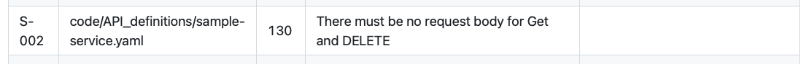
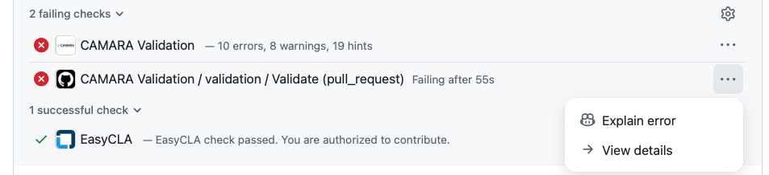

# Where to see validation results

CAMARA Validation reports its results in several places in GitHub. Each place has a different purpose and a different level of detail. This page describes those places. For what to do about a result, see the task pages linked at the end.

> The workflow summary is the full report. Annotations are useful but partial.

## What you see on a pull request

Most pull requests in CAMARA API repositories come from forks. The fork case is the default described here; same-repository pull requests show one extra entry, noted at the end of the section.

Open the pull request's **Conversation** tab. The checks panel lists the validation result.

The check entry is named:

```
CAMARA Validation / validation / Validate (pull_request)
```

Click **Details** on the entry, then open the **Summary** tab on the run page. The workflow summary lists every problem in a table, grouped by check kind, with rule code, source file, line, message, and optional hint.



### Annotations

Annotations attach to the lines they apply to. They appear on the pull request's **Checks** tab as one card per problem, with the source file and line, the title, and the `[rule-code] message` body. The same annotations also appear inline on the **Files changed** tab next to the changed lines.

![Single annotation card on the Checks tab: red "Check failure on line 130 in code/API_definitions/sample-service.yaml" header, the bold red title "GET / DELETE must not have a request body", and the body "[S-002] There must be no request body for Get and DELETE"](images/annotation-s002.png)

For the content of a single annotation, see [Validation problem messages](problem-messages.md).

### Same-repository pull requests

If the pull request branch is in the same repository as `main` (write access available), a second CAMARA Validation entry appears in the checks panel:

```
camara-validation / CAMARA Validation
```

This is the GitHub App's Check Run. It shows a concise totals line such as `10 errors, 8 warnings, 19 hints` and lists every problem as an annotation card with title and message. The pass/fail signal agrees with the workflow check.



For pull requests from a fork, this second entry is not available. The workflow check and the workflow summary still show the complete results.

## Annotations have limits

Annotations are convenient, but they do not show the whole picture:

- Annotations only appear on **changed files**. Problems in unchanged files are absent from both annotation tabs but are still in the workflow summary.
- Very large pull requests may not show every annotation inline. The workflow summary always lists the complete set.
- On pull requests from a fork, GitHub further limits the number of annotations shown inline per severity. The full results are still in the workflow summary.
- A pull request comment from the validation workflow does not appear on fork pull requests. Writing a comment requires write permission, which fork pull requests do not have.

A passing **CAMARA Validation** check does not mean there are no warnings or hints — only that no errors blocked the run. Warnings and hints are still listed in the workflow summary; review them before merging or before a release.

## What you see on a Release Issue

When a release coordinator posts `/create-snapshot` on a Release Issue, CAMARA Validation runs against the current branch content before any snapshot is created. The Release Issue receives a bot reply with the result.

If validation fails, the bot reply says the snapshot failed, includes a one-line summary of the validation result (counts of blocking problems, errors, warnings, and hints), and links to the workflow run.


The full list of problems is on the linked run's workflow summary, not in the Release Issue itself.

For what to do about a `/create-snapshot` failure, see [Validation during snapshot creation](release-snapshots.md).

## What you see on a Release PR

A Release PR shows the same check entries, annotations, and workflow summary as a normal pull request. The validation check is a transparency check on the generated release content.

For what to do about a problem reported on a Release PR — and what you must not change there — see [Validation on a Release PR](release-prs.md).

## Where to start when something fails

A short triage path:

1. Look at the **CAMARA Validation** entry in the pull request's checks panel — it shows pass or fail.
2. If the change is small, scan the **annotations** on the Checks tab or the Files changed tab for quick wins.
3. Open the **workflow summary** for the complete list, especially when:
   - the change is large,
   - the pull request is from a fork,
   - or you want to see warnings and hints, not only errors.
4. For an explanation of a specific rule code, open the [Validation FAQ](faq.md).

## Related

- [Validation on pull requests](pull-requests.md)
- [Validation during snapshot creation](release-snapshots.md)
- [Validation on a Release PR](release-prs.md)
- [Validation problem messages](problem-messages.md)
- [Validation FAQ](faq.md)
- [Release process: lifecycle](https://github.com/camaraproject/ReleaseManagement/blob/main/documentation/release-process/lifecycle.md)
