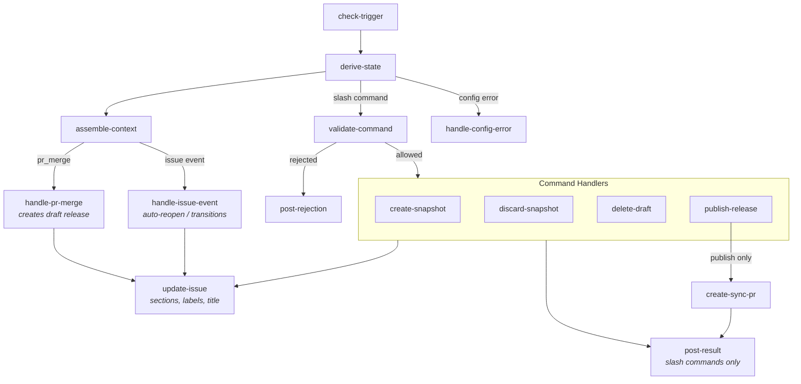
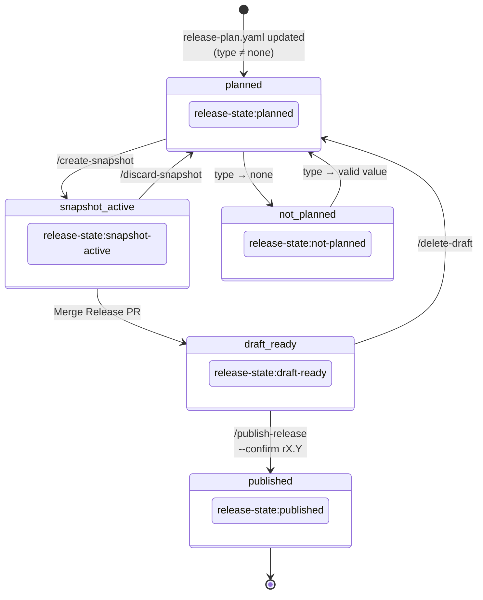

# Release Creation Workflow — Technical Architecture

**Last Updated**: 2026-02-10

## Executive Summary

This document defines the technical architecture for the CAMARA release creation workflow automation. The architecture follows existing patterns established in the `tooling` repository (caller/reusable workflows, composite actions, Python scripts) while introducing new components for release orchestration.

### Design Principles

1. **Centralized logic, distributed triggers**: Core functionality in `tooling` repository; API repos have minimal caller workflows
2. **Fast feedback**: Early acknowledgment posted immediately (~5s), replaced with interim status for validated commands, then final results
3. **State from artifacts**: Derive state from repository artifacts (branches, tags, releases), not stored in issues
4. **Extensible transformations**: Placeholder replacement patterns configurable and extensible
5. **Clear separation**: Mechanical changes (automation-owned) vs documentation (human-reviewable)

---

## 1. Repository Structure

### Additions to `camaraproject/tooling`

```
tooling/
├── .github/workflows/
│   └── release-automation-reusable.yml   # Core reusable workflow
│
├── release_automation/                    # Top-level module
│   ├── workflows/
│   │   └── release-automation-caller.yml # Caller template for API repos
│   │
│   ├── scripts/
│   │   ├── __init__.py
│   │   ├── bot_context.py               # BotContext dataclass
│   │   ├── bot_responder.py             # Message formatting + template rendering
│   │   ├── changelog_generator.py       # CHANGELOG draft generation
│   │   ├── config.py                    # Shared constants and configuration
│   │   ├── context_builder.py           # build_context() for unified context
│   │   ├── git_operations.py            # Git operations for snapshot/review branches
│   │   ├── github_client.py             # GitHub API wrapper
│   │   ├── issue_manager.py             # Issue description/title updates
│   │   ├── issue_sync.py                # Release Issue lifecycle management
│   │   ├── mechanical_transformer.py    # Placeholder replacement
│   │   ├── metadata_generator.py        # release-metadata.yaml generation
│   │   ├── post_release_syncer.py       # Post-release sync PR to main
│   │   ├── readme_updater.py            # README Release Information updater
│   │   ├── release_publisher.py         # Draft release publication
│   │   ├── snapshot_creator.py          # Snapshot + release-review branch creation
│   │   ├── state_manager.py             # State derivation logic
│   │   ├── template_loader.py           # Shared template loading utilities
│   │   ├── version_calculator.py        # API version extension calculation
│   │   └── workflow_context.py          # Workflow context assembly helpers
│   │
│   ├── templates/
│   │   ├── bot_messages/
│   │   │   ├── command_rejected.md
│   │   │   ├── config_drift_warning.md
│   │   │   ├── config_error.md
│   │   │   ├── draft_created.md
│   │   │   ├── draft_revoked.md
│   │   │   ├── interim_processing.md
│   │   │   ├── internal_error.md
│   │   │   ├── issue_created.md
│   │   │   ├── issue_reopened.md
│   │   │   ├── publish_confirmation.md
│   │   │   ├── publish_failed.md
│   │   │   ├── release_published.md
│   │   │   ├── snapshot_created.md
│   │   │   ├── snapshot_discarded.md
│   │   │   ├── snapshot_failed.md
│   │   │   └── state_not_planned.md
│   │   │
│   │   ├── pr_bodies/
│   │   │   ├── release_review_pr.mustache
│   │   │   └── sync_pr.mustache
│   │   │
│   │   ├── readme/
│   │   │   ├── release-info-no-release.mustache
│   │   │   ├── release-info-prerelease-only.mustache
│   │   │   ├── release-info-public.mustache
│   │   │   └── release-info-public-with-prerelease.mustache
│   │   │
│   │   └── changelog/
│   │       └── release_section.mustache
│   │
│   ├── config/
│   │   └── transformations.yaml          # Placeholder transformation rules
│   │
│   ├── tests/
│   │   ├── test_state_manager.py
│   │   ├── test_version_calculator.py
│   │   ├── test_mechanical_transformer.py
│   │   └── fixtures/
│   │
│   └── docs/
│       └── technical-architecture.md     # This document
│
├── shared-actions/
│   ├── create-snapshot/                  # Orchestrates snapshot + release-review branch
│   │   └── action.yml
│   │
│   ├── derive-release-state/            # State derivation from artifacts
│   │   └── action.yml
│   │
│   ├── post-bot-comment/                # Create/update bot comments with templates
│   │   └── action.yml
│   │
│   ├── sync-release-issue/              # Issue lifecycle sync
│   │   └── action.yml
│   │
│   ├── update-issue-section/            # Update reserved sections in issue body
│   │   └── action.yml
│   │
│   ├── update-readme-release-info/      # README Release Information (shared with campaign workflow)
│   │   └── action.yml
│   │
│   └── validate-release-plan/           # Existing plan validation
│       └── action.yml
│
└── validation/schemas/
    └── release-metadata-schema.yaml
```

---

## 2. Component Architecture

### 2.1 State Manager (`state_manager.py`)

Derives release state from repository artifacts. The state is never stored directly — it is computed each time from the current state of branches, tags, and releases.

**State derivation flow:**

```
┌─────────────────────────────────────────────────────────────────┐
│                      State Derivation Flow                       │
├─────────────────────────────────────────────────────────────────┤
│                                                                  │
│  Input: repo, release_tag (e.g., "r4.1")                        │
│                                                                  │
│  ┌──────────────────┐                                           │
│  │ Check tag exists │──── Yes ───► PUBLISHED                    │
│  │  (rX.Y)          │                                           │
│  └────────┬─────────┘                                           │
│           │ No                                                   │
│           ▼                                                      │
│  ┌──────────────────────────┐                                   │
│  │ Check snapshot branch    │──── No ────┐                      │
│  │ (release-snapshot/rX.Y-*)│            │                      │
│  └────────┬─────────────────┘            │                      │
│           │ Yes                          ▼                      │
│           ▼                    ┌─────────────────────────┐      │
│  ┌──────────────────┐         │ Check release-plan.yaml │      │
│  │ Check draft      │         │ target_release_tag      │      │
│  │ release exists   │         │ target_release_type     │      │
│  └────────┬─────────┘         └────────┬────────────────┘      │
│           │                            │                        │
│           ├── Yes → DRAFT_READY        ├── type ≠ "none" and   │
│           │                            │   tag matches         │
│           └── No → SNAPSHOT_ACTIVE     │   → PLANNED           │
│                                        │                        │
│                                        └── else → NOT_PLANNED   │
│                                                                  │
└─────────────────────────────────────────────────────────────────┘
```

**Release states:**

```python
class ReleaseState(Enum):
    PLANNED = "planned"
    SNAPSHOT_ACTIVE = "snapshot-active"
    DRAFT_READY = "draft-ready"
    PUBLISHED = "published"
    NOT_PLANNED = "not_planned"
```

**Key classes:**

- `ReleaseStateManager` — Derives state and reads snapshot metadata from artifacts
- `SnapshotInfo` — Data read from `release-metadata.yaml` on the snapshot branch (snapshot ID, branches, APIs with calculated versions, dependencies)
- `ReleaseInfoResult` — Return type from `get_current_release_info()`, includes either state data or a `ConfigurationError`

### 2.2 Version Calculator (`version_calculator.py`)

Calculates API version extensions based on release history. For pre-release APIs, appends an extension number (e.g., `3.2.0-rc.2`) based on how many prior releases exist for the same API version and status.

**Flow:**

```
┌─────────────────────────────────────────────────────────────────┐
│                    Version Calculation Flow                      │
├─────────────────────────────────────────────────────────────────┤
│                                                                  │
│  Input: api_name, target_version, target_status                 │
│         e.g., "location-verification", "3.2.0", "rc"            │
│                                                                  │
│  Step 1: If target_status == "public" → return target_version   │
│          (e.g., "3.2.0")                                        │
│                                                                  │
│  Step 2: Scan all release tags for this repository              │
│          For each tag, read release-metadata.yaml               │
│          Find versions matching: api_name + target_version +    │
│          target_status                                          │
│                                                                  │
│  Step 3: Count existing extensions                              │
│          e.g., found: ["3.2.0-rc.1"] → count = 1                │
│                                                                  │
│  Step 4: Calculate next extension                               │
│          next = count + 1 = 2                                   │
│          result = "3.2.0-rc.2"                                  │
│                                                                  │
│  Output: "3.2.0-rc.2"                                           │
│                                                                  │
└─────────────────────────────────────────────────────────────────┘
```

Note: `target_status` values are API-level statuses (`draft`, `alpha`, `rc`, `public`) as defined in `release-plan.yaml`. These are distinct from repository-level `release_type` values (`pre-release-alpha`, `pre-release-rc`, `public-release`, `maintenance-release`).

### 2.3 Metadata Generator (`metadata_generator.py`)

Generates `release-metadata.yaml` for snapshot branches, following the schema defined in `release-metadata-schema.yaml`.

**Output structure** (see schema for full validation rules):

```yaml
repository:
  repository_name: string      # From release-plan.yaml
  release_tag: string          # From release-plan.yaml
  release_type: string         # From release-plan.yaml (pre-release-alpha | pre-release-rc | public-release | maintenance-release)
  release_date: null | string  # null at creation, set at publication
  src_commit_sha: string       # Set at snapshot creation (40-char SHA)
  release_notes: string        # Optional, from release-plan.yaml

dependencies:
  commonalities_release: string
  identity_consent_management_release: string

apis:
  - api_name: string
    api_version: string        # Calculated version with extension
    api_title: string          # From OpenAPI info.title
```

**Field timing:**
- `src_commit_sha`: Set at snapshot creation — the full 40-character SHA of the source commit
- `release_date`: Set to null at snapshot creation, populated at publication

### 2.4 Mechanical Transformer (`mechanical_transformer.py`)

Applies placeholder replacements to release branches. Transformations are defined in `config/transformations.yaml` and include:

- **OpenAPI transformations**: `info.version` (wip → calculated version), server URL (`/vwip` → `/vN`), `x-camara-commonalities` version
- **GitHub link transformations**: Rewrite `blob/main/` and `raw.githubusercontent.com/.../main/` links to point to the release tag
- **CHANGELOG transformations**: Mustache-based section generation

Each transformation specifies a file pattern, match type (yaml_path or regex), and replacement template with context variables.

### 2.5 Issue Manager (`issue_manager.py`)

Manages Release Issue description sections and title updates. The issue body uses reserved sections delimited by HTML comment markers (`<!-- BEGIN:STATE -->`, `<!-- BEGIN:CONFIG -->`, `<!-- BEGIN:ACTIONS -->`). Automation updates only within these markers, preserving user-edited content above the automation boundary.

### 2.6 Bot Responder (`bot_responder.py`)

Renders bot messages from Mustache templates using pystache with strict mode (`missing_tags='strict'`). All template variables must be provided by the caller (see Section 2.9 for the unified context contract).

**Comment identification:** Each bot comment includes `<!-- release-bot:{release_tag} -->` for identification. Comments can be created or updated by `comment_id`.

**Template inventory** (`release_automation/templates/bot_messages/`):

| Template | Purpose |
|----------|---------|
| `interim_processing.md` | Immediate feedback for slash commands being processed |
| `command_rejected.md` | Command not allowed in current state or insufficient permissions |
| `config_error.md` | Invalid `release-plan.yaml` (missing, malformed, or incomplete) |
| `config_drift_warning.md` | `release-plan.yaml` changed on main while snapshot is active |
| `snapshot_created.md` | Snapshot and Release PR created successfully |
| `snapshot_failed.md` | Snapshot creation failed |
| `snapshot_discarded.md` | Snapshot discarded by user |
| `draft_created.md` | Draft release created from merged Release PR |
| `draft_revoked.md` | Draft release deleted by user |
| `issue_created.md` | Release Issue auto-created (posted on first sync) |
| `issue_reopened.md` | Issue auto-reopened because active artifacts exist |
| `state_not_planned.md` | Release set to NOT_PLANNED (`target_release_type: none`) |
| `publish_confirmation.md` | Confirmation prompt before publication |
| `release_published.md` | Release published successfully |
| `publish_failed.md` | Publication failed |
| `internal_error.md` | Unexpected internal error |

**PR body templates** (`release_automation/templates/pr_bodies/`):
- `release_review_pr.mustache` — Release Review PR body with checklist
- `sync_pr.mustache` — Post-release sync PR body

**Other templates:**
- `readme/*.mustache` — 4 README Release Information templates (ported from campaign workflow)
- `changelog/release_section.mustache` — CHANGELOG draft section template

---

### 2.7 Issue Sync (`issue_sync.py`)

Synchronizes Release Issue lifecycle with current state derived from artifacts.

**Key behaviors:**
- Creates workflow-owned Release Issue when PLANNED state detected and no open workflow-owned issue exists
- Updates issue sections and labels when state changes
- Sets NOT_PLANNED when `target_release_type: none`
- Ignores manually-created issues (no workflow marker)

**Workflow-owned marker:** Issues created by automation include a hidden marker:
```markdown
<!-- release-automation:workflow-owned -->
```

---

### 2.8 Issue Closure Policy

Closure behavior depends on the current release state:

| State | Close Allowed? | System Reaction |
|-------|----------------|-----------------|
| PLANNED | Yes | No semantic effect; issue treated as historical |
| SNAPSHOT_ACTIVE | No | Auto-reopened with `issue_reopened.md` message |
| DRAFT_READY | No | Auto-reopened with `issue_reopened.md` message |
| PUBLISHED | Yes | Normal closure (automatic after success message is posted) |
| NOT_PLANNED | Yes | Humans close manually |

**Key rules:**
- Closing in PLANNED state does **NOT** cancel the release — release intent is derived only from `release-plan.yaml`
- Automation auto-closes after the success message is posted (PUBLISHED state only)
- If issue is closed in PLANNED and state remains PLANNED, automation creates a new issue on next sync trigger
- NOT_PLANNED is derived from `target_release_type: none`, not from issue closure. A closed NOT_PLANNED issue is not reopened — a *new* issue is created if the plan changes back to a valid release type.

---

### 2.9 Bot Message Context Contract

The workflow has multiple points that consume context data for rendering output. A unified context contract ensures all consumers receive all required variables regardless of the current state or trigger path.

#### Consumers

All consumers draw from the same unified context (BotContext schema):

| Consumer | Module | Rendering |
|----------|--------|-----------|
| Bot message templates (16) | bot_responder.py | Mustache (pystache strict mode) |
| Issue description (create/update) | issue_sync.py → issue_manager.py | f-string formatting |
| Issue config/actions sections | issue_sync.py → issue_manager.py | f-string formatting |
| Mechanical transformer | mechanical_transformer.py | Config-driven replacement |
| CHANGELOG generation | changelog_generator.py | Mustache template |
| README update | readme_updater.py | Mustache template + delimiter replacement |

#### BotContext Schema

All context variables are defined in a single `BotContext` dataclass (`bot_context.py`). The `build_context()` function (`context_builder.py`) constructs it from workflow job outputs, fills defaults for any missing data, and returns a dict guaranteed to have all keys.

**Principle:** If the data is produced by the workflow, make it available in the context — even if no current consumer uses it.

**Naming convention:** Field names follow `release-metadata.yaml` as the canonical source. All layers use the same canonical names — e.g., `src_commit_sha` (not `base_commit_sha`), `api_name`/`api_version`.

| Field | Type | Default | Source |
|-------|------|---------|--------|
| **Trigger fields** | | | |
| `command` | str | `""` | check-trigger |
| `command_args` | str | `""` | check-trigger |
| `user` | str | `""` | check-trigger |
| `trigger_pr_number` | str | `""` | check-trigger |
| **State fields** | | | |
| `release_tag` | str | `""` | derive-state |
| `state` | str | `""` | derive-state |
| `release_type` | str | `""` | derive-state / release-plan |
| `meta_release` | str | `""` | release-plan |
| **Snapshot fields** | | | |
| `snapshot_id` | str | `""` | derive-state |
| `snapshot_branch` | str | `""` | derive-state |
| `release_review_branch` | str | `""` | derive-state |
| `src_commit_sha` | str | `""` | derive-state |
| `release_pr_number` | str | `""` | create-snapshot output |
| `release_pr_url` | str | `""` | create-snapshot output |
| **API fields** | | | |
| `apis` | list | `[]` | derive-state / create-snapshot |
| — `api_name` | str | | release-plan / release-metadata |
| — `target_api_version` | str | | release-plan |
| — `target_api_status` | str | | release-plan |
| — `api_version` | str | | release-metadata (calculated) |
| — `api_title` | str | | release-metadata (from OpenAPI) |
| **Dependency fields** | | | |
| `commonalities_release` | str | `""` | derive-state / create-snapshot |
| `identity_consent_management_release` | str | `""` | same |
| **Error fields** | | | |
| `error_message` | str | `""` | various |
| `error_type` | str | `""` | derive-state `config_error_type` |
| **Derived boolean flags** | | | |
| `is_missing_file` | bool | `False` | derived: `error_type == "missing_file"` |
| `is_malformed_yaml` | bool | `False` | derived: `error_type == "malformed_yaml"` |
| `is_missing_field` | bool | `False` | derived: `error_type == "missing_field"` |
| `state_snapshot_active` | bool | `False` | derived: `state == "snapshot-active"` |
| `state_draft_ready` | bool | `False` | derived: `state == "draft-ready"` |
| **Display fields** | | | |
| `workflow_run_url` | str | `""` | constructed in workflow |
| `draft_release_url` | str | `""` | handle-pr-merge output |
| `reason` | str | `""` | command_args (discard/delete) |

**APIs list — two data sources:**

The `apis` list combines data from two artifacts with different availability:

| Field | Source artifact | Available in PLANNED | Available in SNAPSHOT_ACTIVE+ |
|-------|----------------|---------------------|------------------------------|
| `api_name` | release-plan / release-metadata | Yes | Yes |
| `target_api_version` | release-plan | Yes | Yes |
| `target_api_status` | release-plan | Yes | Yes |
| `api_version` | release-metadata (calculated) | No | Yes |
| `api_title` | release-metadata (from OpenAPI) | No | Yes |

In PLANNED state, only target fields are populated. In SNAPSHOT_ACTIVE/DRAFT_READY, derive-state merges data from both artifacts.

#### Data Layering: ReleaseMetadata vs SnapshotInfo vs BotContext

| Dataclass | Module | Purpose |
|-----------|--------|---------|
| `ReleaseMetadata` | metadata_generator.py | Defines what's persisted in `release-metadata.yaml` |
| `SnapshotInfo` | state_manager.py | Data read back from artifacts by derive-state |
| `BotContext` | bot_context.py | Consumer-facing aggregation from all sources |

`BotContext` is a consumer-facing aggregation, NOT a replacement for `ReleaseMetadata`. The `build_context()` function fills defaults for everything missing — most fields are empty strings in PLANNED state.

**Data availability by state:**

| State | release-metadata.yaml? | Metadata fields in context? |
|-------|------------------------|-----------------------------|
| PLANNED | No | Only from release-plan.yaml |
| SNAPSHOT_ACTIVE | Yes (snapshot branch) | Full — derive-state extracts all data |
| DRAFT_READY | Yes (snapshot branch) | Full |
| PUBLISHED | Yes (on tag) | Derive-state does not read metadata from published tags |
| NOT_PLANNED | No | No |
| Config error | Unknown | No |

---

### 2.10 Release Documentation Generators

Two Python modules generate release documentation on the release-review branch, creating the commits that differentiate it from the snapshot branch.

#### 2.10.1 README Updater (`readme_updater.py`)

Updates the "Release Information" section in README.md, replacing content between delimiters (`<!-- CAMARA:RELEASE-INFO:START -->` / `<!-- CAMARA:RELEASE-INFO:END -->`).

**Release state determination** (during `/create-snapshot`):

| release_type | Prior public release? | → release_state |
|-------------|----------------------|-----------------|
| pre-release-alpha / pre-release-rc | No | prerelease_only |
| pre-release-alpha / pre-release-rc | Yes | public_with_prerelease |
| public-release / maintenance-release | (any) | public_release |

**Delimiter policy:** Delimiters must already exist in README.md. If missing, the update fails with an error (the campaign workflow's `ensure-delimited-section` action handles initial marker insertion).

**Templates:** 4 Mustache templates in `release_automation/templates/readme/`, ported from the campaign workflow.

**Shared action wrapper:** `shared-actions/update-readme-release-info/action.yml` wraps `readme_updater.py` for use by both release automation and the campaign workflow.

#### 2.10.2 CHANGELOG Generator (`changelog_generator.py`)

Generates structured CHANGELOG draft sections for maintainers to complete during release review.

**File structure:**
```
CHANGELOG/
├── CHANGELOG-r4.md    # Sections for r4.1, r4.2 (newest first)
├── CHANGELOG-r3.md    # Sections for r3.1, r3.2
└── CHANGELOG-r2.md    # Sections for r2.1, r2.2
```

**Cycle mapping:** Extract first number from release_tag: `r4.1` → cycle `4` → `CHANGELOG/CHANGELOG-r4.md`

**Template:** Generates per-release sections with release header (all APIs and dependencies), per-API sections with ReDoc/Swagger/YAML links, empty Added/Changed/Fixed/Removed subsections, and a collapsible candidate changes section listing merged PRs (from GitHub compare API).

---

### 2.11 Release Publisher (`release_publisher.py`)

Handles publication of draft releases via the `/publish-release` command.

**Publication steps:**
1. Find draft release by tag
2. Finalize `release-metadata.yaml` (set `release_date` to ISO 8601 UTC timestamp)
3. Commit finalization to snapshot branch
4. Update draft to published (creates tag `rX.Y`)
5. Mark as latest release (if `public-release` type) — requires separate API call from the draft→published transition
6. Create reference tag `src/rX.Y` on main at the source commit SHA

**GitHub API note:** `make_latest` is ignored when sent in the same PATCH as `draft=false`. Publication and latest-marking must be separate API calls.

---

### 2.12 Post-Release Syncer (`post_release_syncer.py`)

Creates a sync PR to main after release publication.

**Sync PR content:**
- Release-specific CHANGELOG: `CHANGELOG/CHANGELOG-rX.md` (X = cycle number from release tag)
- README Release Information section update (between delimiters)

**Branch:** `post-release/rX.Y` created from main.

**Merge policy:** Human approval required (no auto-merge).

---

## 3. Workflow Architecture

### 3.1 Event Flow

```
┌─────────────────────────────────────────────────────────────────────────┐
│                          Trigger Events                                  │
├─────────────────────────────────────────────────────────────────────────┤
│                                                                          │
│  issue_comment (created)          issues (closed/reopened)              │
│         │                                │                               │
│         ▼                                ▼                               │
│  ┌─────────────────┐            ┌─────────────────┐                     │
│  │ Slash command?  │            │ Release issue?  │                     │
│  │ /create-snapshot│            │ Has state label │                     │
│  │ /discard-snapshot│           └────────┬────────┘                     │
│  │ /delete-draft   │                     │                               │
│  │ /publish-release│                     │                               │
│  └────────┬────────┘                     │                               │
│           │                              │                               │
│           └──────────┬───────────────────┘                               │
│                      │                                                   │
│                      ▼                                                   │
│         pull_request (closed + merged)                                   │
│                      │                                                   │
│                      ▼                                                   │
│            ┌─────────────────┐                                          │
│            │ Base branch is  │                                          │
│            │ release-snapshot│──── Yes ──► Draft release creation       │
│            └─────────────────┘                                          │
│                                                                          │
│         push (main branch, release-plan.yaml changed)                   │
│                      │                                                   │
│                      ▼                                                   │
│            Auto-trigger sync-issue                                      │
│                                                                          │
└─────────────────────────────────────────────────────────────────────────┘
```

### 3.2 Caller Workflow (API Repositories)

Each API repository has a minimal caller workflow that forwards events to the reusable workflow in `tooling`.

**Triggers:**

| Event | Condition | Purpose |
|-------|-----------|---------|
| `issue_comment` (created) | Slash command on release issue | Command execution |
| `issues` (closed/reopened) | Issue has `release-state:*` label | Closure policy enforcement |
| `pull_request` (closed) | Merged into `release-snapshot/*` branch | Draft release creation |
| `push` (main) | `release-plan.yaml` changed | Auto sync-issue |
| `workflow_dispatch` | Manual trigger | Recovery (sync-issue only) |

**Concurrency:** Global concurrency group per repository (`release-automation-{repo}`) with `cancel-in-progress: false`. This prevents overlapping workflow runs from producing inconsistent state.

**Commands:**

| Command | Description | Required State | Who may execute |
|---------|-------------|----------------|-----------------|
| `/create-snapshot` | Create snapshot and Release PR | PLANNED | Codeowner |
| `/discard-snapshot <reason>` | Discard current snapshot | SNAPSHOT_ACTIVE | Codeowner, Release manager |
| `/delete-draft <reason>` | Delete draft release | DRAFT_READY | Codeowner, Release manager |
| `/publish-release` | Request publication confirmation | DRAFT_READY | Codeowner |
| `/publish-release --confirm <tag>` | Publish release, create sync PR | DRAFT_READY | Codeowner |

**Note:** `sync-issue` is an internal workflow action, not a user-facing slash command. It runs automatically after state changes and on push to main when `release-plan.yaml` changes. Available via `workflow_dispatch` for recovery only.

### 3.3 Reusable Workflow (Tooling Repository)

The reusable workflow (`release-automation-reusable.yml`) orchestrates all release operations. Jobs execute in phases with conditional branching based on trigger type and command validation.

**Job execution order:**



**3-stage feedback model** (slash commands only):

| Stage | Job | Timing | Content |
|-------|-----|--------|---------|
| 1. Ack | check-trigger (ack step) | ~8 seconds | Brief acknowledgment that command was received |
| 2. Interim | post-interim | After validate-command passes | Processing status with workflow run link |
| 3. Result | post-result | After command completes | Final outcome (success/failure details) |

All three stages edit the same comment (using `comment_id`). For rejected commands, the ack comment is directly updated with the rejection message (skipping interim). The interim stage is gated on `validate-command.allowed == 'true'`.

**Central context assembly** (`assemble-context` job):

The `assemble-context` job runs early — right after `derive-state` — and constructs the base BotContext from `check-trigger` and `derive-state` outputs using `build_context()`. All downstream jobs (command handlers, `update-issue`, `post-result`) depend on it and consume context from this single source. Command handler outputs (e.g., `release_pr_url`) are passed as delta context to `post-result` for the final message.

---

## 4. Shared Actions

### 4.1 derive-release-state

Derives current release state from repository artifacts. Takes no inputs — `release_tag` is derived from `release-plan.yaml` (main) or `release-metadata.yaml` (snapshot branch).

**Outputs:** `release_tag`, `state`, `release_type`, `source`, `snapshot_id`, `snapshot_branch`, `release_review_branch`, `release_pr_number`, `src_commit_sha`, `apis_json`, `commonalities_release`, `identity_consent_management_release`, `config_error`, `config_error_type`

**State values:** `planned`, `snapshot-active`, `draft-ready`, `published`, `not-planned`

### 4.2 post-bot-comment

Creates or updates a bot comment with a release-specific marker (`<!-- release-bot:{release_tag} -->`).

**Inputs:** `issue_number`, `release_tag`, `template`, `context` (JSON), `comment_id` (optional — update existing)

**Output:** `comment_id`

### 4.3 update-issue-section

Updates a reserved section in the issue description between `<!-- BEGIN:{section} -->` / `<!-- END:{section} -->` markers.

**Inputs:** `issue_number`, `section` (STATE, CONFIG, ACTIONS), `content`

### 4.4 sync-release-issue

Synchronizes Release Issue with current derived state. Creates issues when none exists and state is PLANNED. Updates sections, labels, and title on state changes.

**Inputs:** `owner`, `repo`, `release_tag`, `state`, `snapshot_branch`, `release_pr_number`, `trigger_type`, `command_result`, `github_token`

**Outputs:** `issue_number`, `issue_action`, `issue_url`

### 4.5 create-snapshot

Orchestrates the full snapshot creation flow: validate release plan, calculate API versions, create snapshot branch with transformations, generate release-metadata.yaml, create release-review branch with README + CHANGELOG commits, create Release PR.

### 4.6 update-readme-release-info

Shared action wrapping `readme_updater.py`. Used by both release automation (during `/create-snapshot`) and the campaign workflow (`campaign-release-info.yml` in project-administration).

---

## 5. Data Flow

### 5.1 `/create-snapshot` Success Flow

```
┌────────────────────────────────────────────────────────────────────────┐
│                     /create-snapshot Success Flow                       │
├────────────────────────────────────────────────────────────────────────┤
│                                                                         │
│  1. User comments: /create-snapshot                                     │
│                    │                                                    │
│                    ▼                                                    │
│  2. Post ack: "⏳ Processing /create-snapshot..."  (~5s)                │
│                    │                                                    │
│                    ▼                                                    │
│  3. Derive state: PLANNED (valid release-plan.yaml, no snapshot)        │
│                    │                                                    │
│                    ▼                                                    │
│  4. Validate: User is codeowner, command allowed in PLANNED             │
│                    │                                                    │
│                    ▼                                                    │
│  5. Update ack → interim: show processing status + workflow link        │
│                    │                                                    │
│                    ▼                                                    │
│  6. Run validation: Schema + semantic + dependencies                    │
│                    │                                                    │
│                    ▼                                                    │
│  7. Calculate versions: "3.2.0-rc.2" based on release history          │
│                    │                                                    │
│                    ▼                                                    │
│  8. Create snapshot branch: release-snapshot/r4.1-abc1234              │
│     - Apply mechanical transformations                                  │
│     - Generate release-metadata.yaml                                    │
│     - Commit + push snapshot branch                                     │
│                    │                                                    │
│                    ▼                                                    │
│  9. Create release-review branch from snapshot HEAD                     │
│     9a. Update README Release Information section                       │
│     9b. Generate CHANGELOG draft → CHANGELOG/CHANGELOG-r4.md           │
│     - Push release-review branch                                        │
│                    │                                                    │
│                    ▼                                                    │
│  10. Create Release PR: release-review → snapshot (2 commits diff)      │
│      Title: "Release Review: RepoName r4.1 (RC, Fall26)"               │
│                    │                                                    │
│                    ▼                                                    │
│  11. Update issue:                                                      │
│      - State section: SNAPSHOT_ACTIVE                                   │
│      - Config: Show release configuration                               │
│      - Label: release-state:snapshot-active                             │
│                    │                                                    │
│                    ▼                                                    │
│  12. Update interim → result: "✅ Snapshot Created" message             │
│                                                                         │
└────────────────────────────────────────────────────────────────────────┘
```

### 5.2 State Label Transitions



**Note:** Release Issues are workflow-owned artifacts. They are created automatically when a valid `release-plan.yaml` is detected (with `target_release_type` ≠ "none") and carry a hidden marker `<!-- release-automation:workflow-owned -->`. Manually created issues are ignored by the automation.

**Issue closure behavior:**
- Closing in PLANNED state has no semantic effect; the issue is treated as historical
- Automation will create a new Release Issue if needed (no open workflow-owned issue exists)
- Auto-reopen only applies when snapshot or draft is active (prevents orphaned artifacts)
- NOT_PLANNED is derived from `target_release_type: none`, not from issue closure

**Config drift warning:** When `release-plan.yaml` changes on main while a snapshot is active, the automation posts a `config_drift_warning` message on the Release Issue. The snapshot remains valid — the warning is informational, alerting maintainers that the plan has diverged from the active snapshot.

### 5.3 Context Data Flow

Data flows from artifacts through derive-state into the unified BotContext for all consumers:

```
release-plan.yaml (main branch)
    │
    ├─► derive-state ──► release_tag, state, release_type
    │                     target_api_version, target_api_status (per API)
    │
release-metadata.yaml (snapshot branch, if exists)
    │
    ├─► derive-state ──► src_commit_sha, snapshot_id, snapshot_branch,
    │                     release_review_branch, release_pr_number,
    │                     api_version, api_title (per API),
    │                     commonalities_release, identity_consent_management_release
    │
    └─► derive-state merges both sources into apis_json
              │
              ▼
    ┌──────────────────────┐
    │  assemble-context    │◄── check-trigger outputs (command, user, trigger_pr_number)
    │  └─ build_context()  │◄── derive-state outputs (all above)
    │                      │◄── command action outputs (release_pr_url, draft_release_url, ...)
    │                      │◄── workflow env (workflow_run_url)
    └────────┬─────────────┘
             │
             ▼
    ┌─────────────────┐
    │   BotContext     │──► bot_responder.render() ──► bot comments
    │   (complete,    │──► issue_manager ──► issue description, config section
    │    no missing   │
    │    keys)        │
    └────────┬────────┘
             │
             │  (during create-snapshot only, from snapshot_creator.py)
             │
             ├──► readme_updater.py ──► README Release Information section
             │
             └──► changelog_generator.py ──► CHANGELOG/CHANGELOG-r{cycle}.md
```

**Fresh vs stale data:** When create-snapshot runs in the same workflow, its outputs (release_pr_url, api versions) are fresh. On subsequent workflow runs (e.g., issue close/reopen), derive-state reads the same data from persisted artifacts — this is functionally equivalent, not stale.

---

## 6. Error Handling

### 6.1 Error Categories

| Category | Example | Response Template | Recovery |
|----------|---------|-------------------|----------|
| Configuration | Invalid release-plan.yaml | `config_error` | Fix config, re-trigger |
| Validation | Missing test file | `snapshot_failed` | Fix on main, retry |
| Permission | Non-maintainer / non-codeowner | `command_rejected` | Contact codeowner |
| State | `/create-snapshot` when snapshot active | `command_rejected` | Discard first |
| GitHub API | Branch creation fails | `internal_error` | Retry or escalate |

### 6.2 Graceful Degradation

Snapshot creation includes cleanup on failure: if an error occurs after branches are created, partial state (snapshot branch, release-review branch) is cleaned up before reporting the error. The `snapshot_failed` message includes the workflow run URL for debugging.

---

## 7. Security Considerations

### 7.1 Permission Model

| Action | Required Permission |
|--------|---------------------|
| `/create-snapshot` | Codeowner |
| `/discard-snapshot` | Codeowner or RM team |
| `/delete-draft` | Codeowner or RM team |
| `/publish-release` | Codeowner |
| Merge Release PR | Codeowner + RM reviewer approval |

Permission checks use the GitHub API (`GET /repos/{owner}/{repo}/collaborators/{user}/permission`). The `/publish-release` command additionally verifies CODEOWNERS file presence.

### 7.2 Branch Protection

| Branch Pattern | Protection |
|----------------|------------|
| `release-snapshot/*` | Push: automation only; Delete: automation only |
| `release-review/*` | Push: codeowners + automation; Delete: automation |

**Release PR approval requirements:**
- At least one **codeowner** approval required
- At least one **Release Management reviewer** approval required
- Enforced via repository rulesets on `release-snapshot/*` branches

Three repository rulesets enforce these protections. GitHub Actions is configured as a bypass actor to allow workflow operations while blocking direct human access. See [repository-setup.md](repository-setup.md#repository-rulesets) for exact ruleset definitions, API payloads, and the verification checklist.

### 7.3 Secrets

- `GITHUB_TOKEN`: Default workflow token (sufficient for same-repo operations)
- No additional secrets required for MVP

---

## 8. pr_validation Integration

When `release-plan.yaml` changes in a PR, the existing `pr_validation` workflow performs additional checks. After the PR merges and `release-plan.yaml` lands on main, the push trigger automatically runs the release automation workflow.

### 8.1 Artifact State Check

During PR validation, a simple check blocks the PR if a snapshot is active:

```bash
# Check for snapshot branch - blocks PR if active
SNAPSHOT=$(gh api repos/$OWNER/$REPO/branches \
  --jq ".[] | select(.name | startswith(\"release-snapshot/$TARGET_TAG-\"))")

if [ -n "$SNAPSHOT" ]; then
  echo "::error::Cannot modify release-plan.yaml while snapshot is active"
  exit 1
fi
```

### 8.2 State Transition Cases

| Current State | release-plan.yaml Change | pr_validation Action | release-automation Action |
|---------------|--------------------------|---------------------|---------------------------|
| No issue | Valid plan (type ≠ none) | Pass | Create issue (PLANNED) |
| PLANNED | Plan updated | Pass | Update issue |
| PLANNED | type → none | Pass | Set NOT_PLANNED, suggest close |
| SNAPSHOT_ACTIVE | Any change | **Block (exit 1)** | Config drift warning posted |
| DRAFT_READY | Any change | **Block (exit 1)** | — |
| PUBLISHED | Any change | Pass (new release cycle) | Create new issue if type ≠ none |

---

## 9. Performance Targets

| Operation | Target | Approach |
|-----------|--------|----------|
| Ack comment | < 5 seconds | Lightweight job, no checkout, no Python |
| State derivation | < 10 seconds | Direct GitHub API calls |
| Full `/create-snapshot` | < 3 minutes | Sequential but optimized |
| Result comment | < 5 seconds | Template rendering + API call |

---

## References

- [CAMARA-Release-Creation-Detailed-Design.md](https://github.com/camaraproject/ReleaseManagement/blob/main/documentation/SupportingDocuments/CAMARA-Release-Creation-Detailed-Design.md) — Source design document
- [release-metadata-schema.yaml](../../validation/schemas/release-metadata-schema.yaml) — Release metadata schema
- [release-plan-schema.yaml](../../validation/schemas/release-plan-schema.yaml) — Release plan schema
- [transformations.yaml](../config/transformations.yaml) — Mechanical transformation rules
